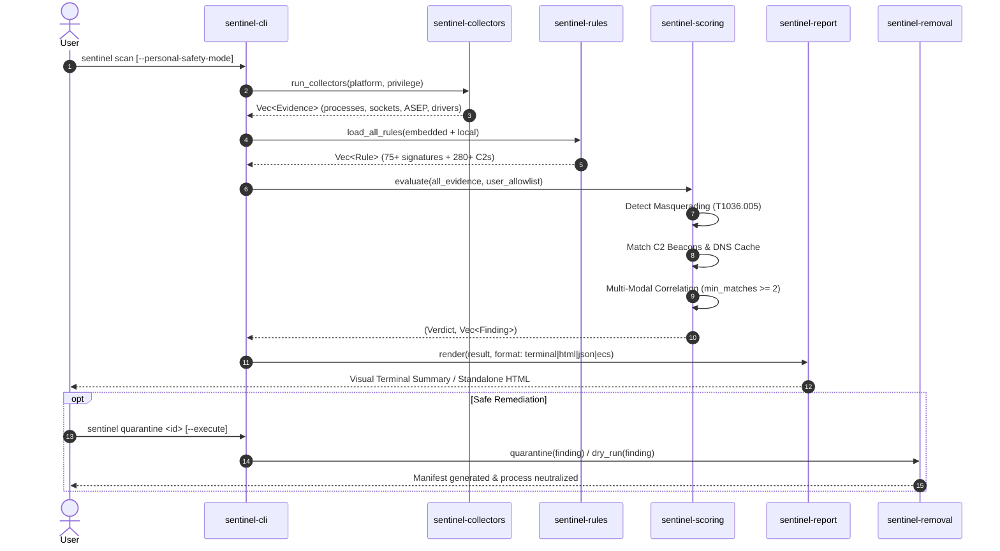

# Sentinel System Architecture

Sentinel is designed as a modular, high-performance Rust workspace. Each subsystem is strictly decoupled into independent crates with clear responsibilities, zero telemetry, and defensive boundaries.

```
                           ┌─────────────────────────┐
                           │      sentinel-cli       │
                           │  (Command-line UX/Clap) │
                           └────────────┬────────────┘
                                        │
           ┌────────────────────────────┼────────────────────────────┐
           ▼                            ▼                            ▼
┌──────────────────────┐     ┌──────────────────────┐     ┌──────────────────────┐
│  sentinel-collectors │     │    sentinel-rules    │     │   sentinel-scoring   │
│  (OS State Evidence) │     │ (YAML Database/Match)│     │ (Multi-Modal Engine) │
└──────────┬───────────┘     └──────────┬───────────┘     └──────────┬───────────┘
           │                            │                            │
           └────────────────────────────┼────────────────────────────┘
                                        ▼
                           ┌─────────────────────────┐
                           │      sentinel-core      │
                           │ (Finding, Evidence, DTO)│
                           └────────────┬────────────┘
                                        │
                         ┌──────────────┴──────────────┐
                         ▼                             ▼
              ┌──────────────────────┐      ┌──────────────────────┐
              │   sentinel-removal   │      │   sentinel-report    │
              │ (Quarantine/Rollback)│      │ (HTML / JSON / ECS)  │
              └──────────────────────┘      └──────────────────────┘
```

---

## Data Flow & Processing Lifecycle



---

## Crate Hierarchy & Responsibilities

### 1. `sentinel-core`
- **Domain Models**: Strongly typed definitions for `Finding`, `Evidence`, `EvidenceData`, `RemovalPolicy`, `Severity`, `Confidence`, and `ScanResult`.
- **Localization (i18n)**: Compile-time bilingual dictionary supporting English (`Lang::En`) and Russian (`Lang::Ru`).
- **Platform Inspection**: Runtime discovery of operating system capabilities, processor architecture, and privilege level (`StandardUser` vs `ElevatedAdmin`).

### 2. `sentinel-collectors`
- Implements the unified `Collector` trait across platforms:
  - **Windows**: Low-level registry run keys, scheduled tasks, Windows services, WMI subscriptions, `CapabilityAccessManager\ConsentStore` (webcam & microphone), `UpperFilters` keyboard filter drivers, and DNS client cache (`ipconfig /displaydns`).
  - **Linux**: `/dev/input` character device handles, evdev sniffing, X11 libraries, PipeWire ScreenCast portals, systemd unit files, XDG autostart entries, and ptrace attach monitoring.
  - **macOS**: LaunchAgents/Daemons, Login items, MDM configuration profiles, CoreGraphics Event Taps, and TCC database permissions (`kTCCServiceScreenCapture`, `kTCCServiceListenEvent`).
  - **Common**: Cross-platform process tree enumeration (PID, parent PID, exe path, command-line arguments) and listening network sockets.
  - **Offline Forensic Mode**: Directory traversal engine for analyzing static disk images without host process queries.

### 3. `sentinel-rules`
- **Schema**: Declarative schema for surveillance detection rules supporting processes, paths, services, registry keys, scheduled tasks, C2 domains, and condition expressions (`min_matches`, `cmdline_regex`).
- **Catalog**: 75+ embedded YAML detection rules compiled directly into the binary for 100% offline usage.
- **Threat Intelligence**: 280+ known mobile and desktop stalkerware Command-and-Control (C2) domains derived from open threat intelligence feeds (AssoEchap, TinyCheck, Citizen Lab).
- **RuleMatcher**: Multi-threaded matching engine correlating gathered evidence against rule signatures.

### 4. `sentinel-scoring`
- **Multi-Modal Correlator**: Enforces corroborating evidence requirements (combining process names with autostart persistence or network sockets) to avoid false positives.
- **Masquerading Detector**: Flags unauthorized processes pretending to be critical Windows binaries (`svchost.exe`, `csrss.exe`, `lsass.exe`) running out of user profile directories (MITRE ATT&CK T1036.005).
- **Allowlist Engine**: Deep allowlist for trusted OS binaries, streaming software (OBS Studio), gaming overlays (Discord, Steam), and accessibility screen readers (NVDA, Narrator).
- **Custom User Allowlist**: In-memory and file-based exclusion filters (`~/.sentinel/allowlist.json`).

### 5. `sentinel-removal`
- **Remediation Manager**: Orchestrates safe multi-step remediation (process termination, service halting, registration deletion, file quarantine).
- **Dry-Run by Default**: Simulates planned actions without altering system state unless `--execute` is provided.
- **Reversible Quarantine Vault**: Moves binaries to `~/.sentinel/quarantine/<finding-id>/` with SHA-256 metadata manifests enabling complete rollback via `sentinel restore`.
- **Personal Safety Lockdown**: Strictly blocks all modification operations when `--personal-safety-mode` is active to protect victims from alerting surveillance operators.

### 6. `sentinel-report`
- **Standalone HTML Generator**: Self-contained single-file HTML report with zero external CDN dependencies, embedded SVG icons, CSS Grid layout, and interactive MITRE ATT&CK matrix.
- **Structured Exporters**: JSON, JSON Lines (NDJSON), and Elastic Common Schema (ECS) formats for SIEM ingestion (Wazuh, Splunk, Elasticsearch).
- **Terminal Formatter**: High-contrast ANSI-colored summary box with progress indicators.

### 7. `sentinel-cli`
- Top-level command-line application powered by `clap`.
- Manages subcommands (`scan`, `quarantine`, `restore`, `remove`, `explain`, `allow`, `rules`).
- Integrates `indicatif` progress spinners and safety controls.

---

## Modularity & Publishing to Crates.io

The workspace is structured to allow independent reuse:
- Developers can embed `sentinel-core` and `sentinel-rules` into custom EDR agents, forensic tools, or threat-hunting scripts.
- The YAML rule format is independent of the CLI, allowing community-driven signature development and validation without rebuilding the full binary.
